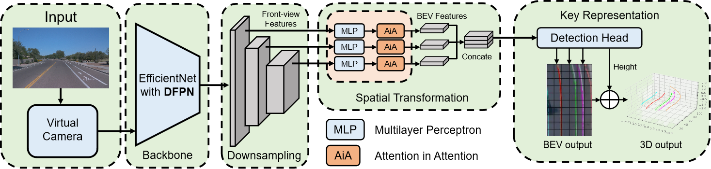

# 3DAiALane SPL 2024



:page_facing_up: 3D Lane Detection With Attention in Attention

:boy: Yinchao Gu, Chao Ma, Qian Li, Xiaokang Yang

**Please consider citing our paper if you find it interesting or helpful to your research.**
```
@article{gu20243d,
  author={Gu, Yinchao and Ma, Chao and Li, Qian and Yang, Xiaokang},
  journal={IEEE Signal Processing Letters}, 
  title={3D Lane Detection With Attention in Attention}, 
  year={2024},
  volume={31},
  pages={1104-1108},
  publisher={IEEE}
}
```

---

### Introduction

We introduce an efficient and robust monocular 3D lane detection model. First, we propose an attention mechanism called attention in attention, to explore the relationship between various correlations and mitigates mismatched correlation problems in attention computation. Furthermore, we introduce a novel feature fusion structure in the backbone called the double feature pyramid network, which effectively gathers feature information with various dimensions and enlarges the receptive field. Our network is based on the [BEV-LaneDet](https://arxiv.org/abs/2210.06006) and achieves impressive performance on the OpenLane dataset. Our paper has been accepted by [IEEE Signal Processing Letters 2024](https://ieeexplore.ieee.org/abstract/document/10500508)

### Installation
- To run our code, make sure you are using a machine with at least one GPU.
- Setup the environment 
```
pip install -r requirement.txt
```

### Training
- Please refer to [OpenLane](https://github.com/OpenPerceptionX/OpenLane) for downloading OpenLane Dataset. For example: download OpenLane dataset to /dataset/openlane
- Please modify the configuration in the /openlane_config.py
- Execute the following command in the console:
```
python train_openlane.py
```

### Evaluation
- Please modify the configuration in the /val_openlane.py
- Execute the following command in the console:
```
python val_openlane.py
```
